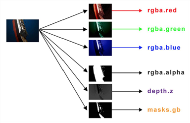
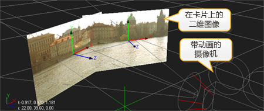

[TOC]

# 关键概念

Nuke产品是不依赖分辨率的合成系统，具有广泛的通道支持，强大的图像处理工具，以及丰富的
3D合成环境。本节说明使用Nuke产品之前你应该知道的概念。、

## 理解工作流

Nuke 工程由被称为节点的操作所连接成的网络组成。Nuke合成环境采用基于节点的工作流程，你可以连接一系列节点读取、处理和操作图像。在脚本或合成中的每个节点执行一个操作，这样有助于输出。

你可以在文本编辑器中打开一个 Nuke 合成文件，将会有一系列连续的命令显示出来，这是当你渲染输出时将会执行的解释语句。

在上面的图片中，你可以看到一个非常简单的Nuke脚本示例。两个Read(读取) 节点引用磁盘上的媒体。效果节点提取遮罩和模糊图像。一个 Merge(合并) 节点设置为 over(正常) 模式，合成素材的前景图像（输入*A*）在背景图像（输入*B*）之上。最后，一个 Write(写入) 节点渲染和输出已完成的合成到磁盘。也有一个 Viewer(查看器) 节点，它可以显示脚本中的任何节点的输出。

_**注：** Nuke Assist 不支持 Write(颜色空间) 或者 渲染农场。详情参阅 Nuke产品。_

## 处理多种颜色格式

Nuke产品支持多种文件格式，如Cineon，TIFF，OpenEXR，HDRI，和原相机数据（使用dcraw的命令行程序），并允许你在同一合成中混合它们。默认情况下，Nuke产品将转换所有导入的序列至32位线性RGB色彩空间。但是你可以使用Colorspace(颜色空间)节点 来强制使用一个颜色模型，包括sRGB、Cineon，rec709，gamma1.80/2.20、HSV、或HSL。Log2Lin节点 让你能够在算法和线性颜色空间之间进行转换（反之亦然）。

_**注：** Nuke Assist 不支持 Colorspace(颜色空间) 或者 Log2Lin 节点。详情参阅 Nuke产品。_

图像分辨率没有限制 - 你可以在同一个脚本自由混合和缩放的任何分辨率的元素。例如,你可以使用一个 2K电影胶片作为 PAL制式视频镜头 的背景，然后以 HD1080i 输出结果。Nuke产品将自动调整查看器以适应你要查看的图像。

## 通道操作

在Nuke产品中，每个节点的输出您都可以指定为新的通道，并将他们用于脚本中的下一个节点。当您需要重新使用一个特定的通道（例如，对头发应用颜色校正），您只需在下游的 ColorCorrection(颜色校正) 节点选择包含遮罩的通道。

Nuke产品支持多达1023通道的图像数据。这提供了处理计算机生成（CG）元素时的额外好处，尤其是当这些元素都使用OpenEXR格式输出时。

_Nuke产品可以在数据流中包含及操作多个通道。_

例如，你的3D部门可以为一个特定的CG元素渲染出多个照明通道（美景、填充、背光源、反射、阴影等）渲染 .exr 序列，从而你可以在Nuke脚本中读取或合成。你将能够从脚本中的任何下游节点访问所有在 .exr 序列内储存的渲染通道。

你可以通过将镜面层设置为一个特定的颜色校正操作的 mask(蒙版) 来仅对CG元素的高光部分进行颜色校正。这样的做法使Nuke 合成免于不必要的复杂分支 - 在单管的合成中可以应用几乎所有的渲染通道和蒙板。

[通道](./)章节介绍了如何充分利用1023通道的工作流程。

## 8位,16位及32位图像处理

一些数字合成系统，尤其是那些面向视频处理工作，专门为8位（即图像每通道强度值分为256级）的元素优化。其他系统允许8，16，和32位元素的混合。

Nuke产品一开始是作为电影特效工具进行开发，所以着重于图像质量。因此，它们仅支持处理每通道32位的元素（具有较低的比特深度的元素将在导入时被转换为每通道32位）。32位支持代表着一个更丰富的调色板及在所有脚本计算时的浮点精度。在实践中，这意味着Nuke产品进行的每一个操作(从增加gamma 到位移)相比较低位深度的系统具有更高的精度。

## 在三维中合成

一些数字合成系统仅支持二维工作流。相比之下，Nuke产品提供了强大的三维工作空间，让您创建和渲染多边形模型，卡片（使用图像作为纹理的面片），相机，灯光和纹理组成的复杂的场景。

此三维工作空间有无数的用途，其中最简单的是生成平铺的场景。即将场景中的二维图像平面排列成一个弯曲的形状，然后通过一个带动画相机渲染出来一种无缝环境的错觉。

简单平铺的场景。三维合成章节解释了如何充分使用Nuke的三维工作空间。

## 渲染农场和帧服务器‌

Nuke产品支持几乎所有的第三方和专有软件渲染队列。通过Nuke产品这样一个系统的集成，使负载可以分布在您的网络中所有拥有Nuke或NukeX许可的机器上，无论是Windows，Mac或Linux。请参阅 渲染农场 以了解更多信息。

此外，Nuke Studio 包含一个内置的帧服务器，它还允许您设置外部从属机使渲染速度更快。请参阅 使用外部机器上的帧服务器 以了解更多信息。

_注：Nuke Assist 不支持 Write(写入) 节点,渲染农场,或帧服务器。请参阅 Nuke产品 以了解更多信息。_

